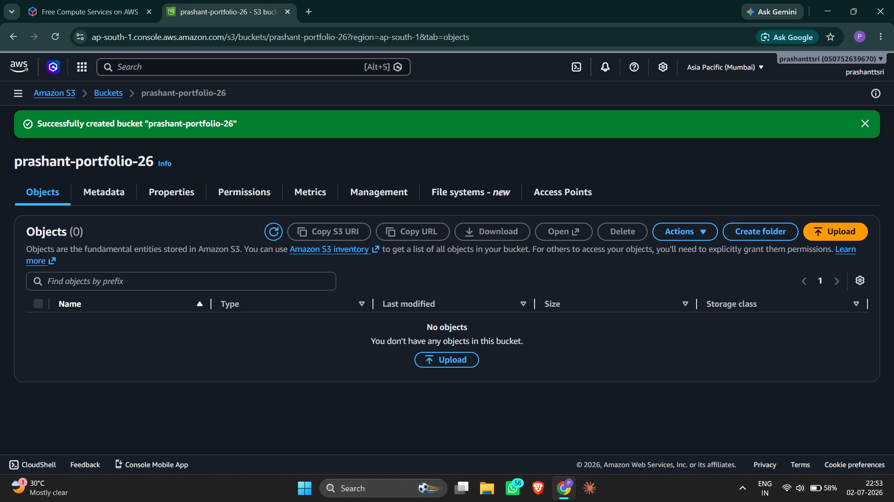
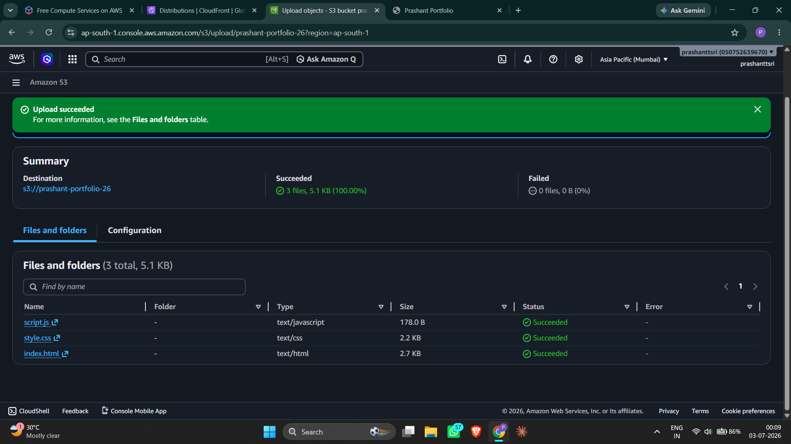
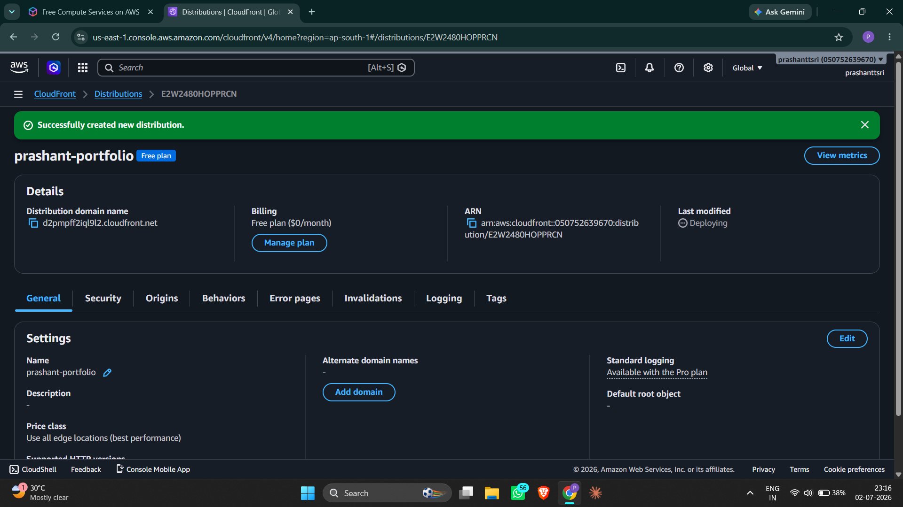
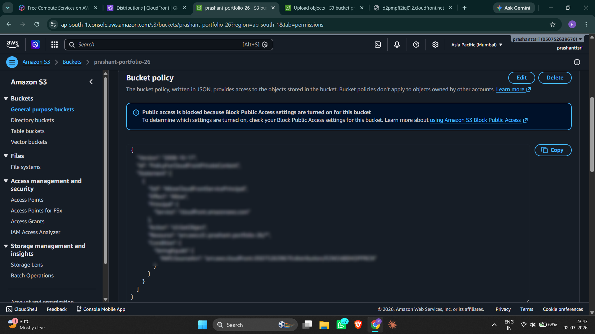
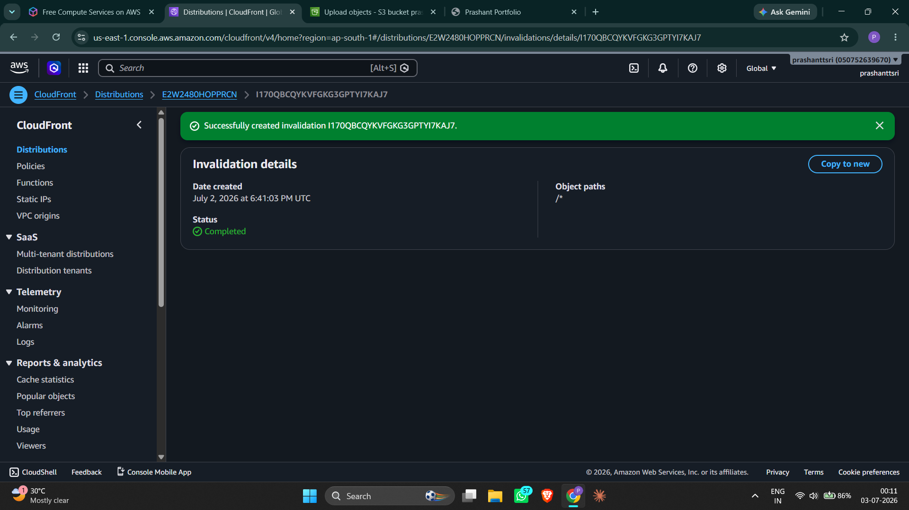
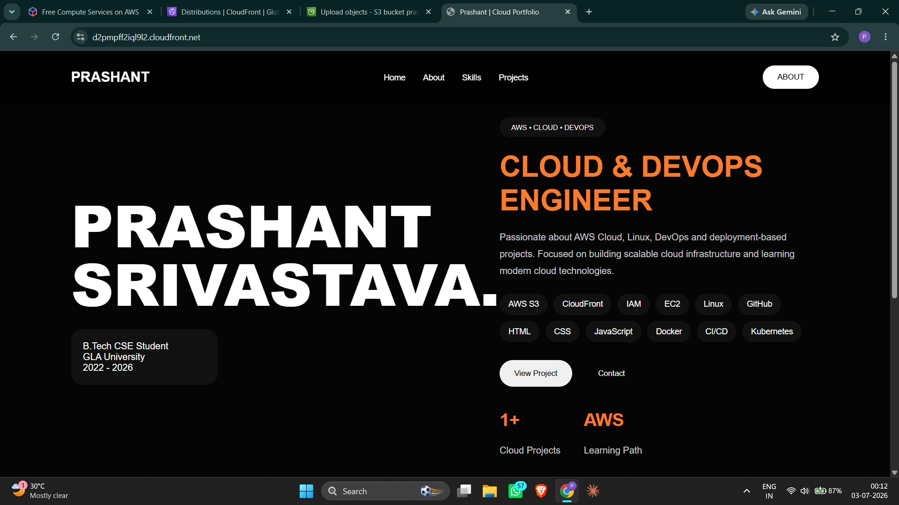

# 🌐 Static Website Hosting on AWS

A production-style static portfolio website hosted on AWS using Amazon S3, CloudFront with Origin Access Control (OAC), and AWS Certificate Manager (ACM) for HTTPS. Built as a hands-on cloud infrastructure project to demonstrate core AWS skills.

---

## 🚀 Live Site

🔗 https://d2pmpff2iql9l2.cloudfront.net

---

## ✨ Features

- Static website hosting using Amazon S3
- Private S3 bucket with secure access
- Global content delivery using CloudFront CDN
- HTTPS enabled using AWS ACM
- Origin Access Control (OAC) for enhanced security
- Fast deployment using AWS CLI
- Production-style cloud setup

---

## 🏗️ Architecture

Browser → CloudFront (HTTPS + CDN) → OAC → S3 (Private Bucket)

| Layer | Service | Purpose |
|---|---|---|
| Storage | Amazon S3 | Stores all static files (HTML, CSS, JS) privately |
| CDN | Amazon CloudFront | Serves files globally via edge locations with HTTPS |
| Security | Origin Access Control (OAC) | Ensures only CloudFront can access S3 |
| SSL/TLS | AWS ACM | Free HTTPS certificate attached to CloudFront |

---

## 📁 Project Structure

```text
aws-static-website/
├── site/
│   ├── index.html
│   ├── style.css
│   └── 404.html
├── screenshots/
│   ├── 01-S3-bucket-created.png
│   ├── 02-Bucketfiles-uploaded.png
│   ├── 03-cloudfront-created.png
│   ├── 04-bucket-policy.png
│   ├── 05-cloudfront-invalidation-created.png
│   └── 06-live-site.png
├── bucket-policy.json
├── deploy.sh
└── README.md
```

---

## 🛠️ Services Used

- **Amazon S3** — Static file storage with block public access enabled
- **Amazon CloudFront** — Global CDN with HTTPS, caching, and edge delivery
- **Origin Access Control (OAC)** — Secures S3 origin access
- **AWS Certificate Manager (ACM)** — Free SSL/TLS certificate for HTTPS

---

## 📸 Deployment Screenshots

| Step | Screenshot |
|---|---|
| S3 Bucket Created |  |
| Files Uploaded |  |
| CloudFront Distribution |  |
| Bucket Policy Applied |  |
| CloudFront Invalidation |  |
| Live Site |  |

---

## 💰 Cost Breakdown

| Service | Cost |
|---|---|
| Amazon S3 | Free tier — 5GB storage for 12 months |
| Amazon CloudFront | Free tier — 1TB transfer + 10M requests/month |
| AWS ACM | Always free when attached to CloudFront |
| **Total** | **$0/month** |

> Route 53 (~$0.50/month per hosted zone + domain cost) and AWS WAF (~$5–8/month) are optional add-ons and not used in this setup.

---

## 🔄 How to Update the Site

### 1. Edit files locally inside `site/`

### 2. Upload changes to S3

```bash
aws s3 sync site/ s3://prashant-portfolio-26 --delete
```

### 3. Invalidate CloudFront cache

```bash
aws cloudfront create-invalidation --distribution-id MY_ID --paths "/*"
```

---

## 📚 What I Learned

- How to host a static website using S3 with private bucket access
- How CloudFront works as a CDN
- How Origin Access Control secures S3 content
- How to configure HTTPS using ACM
- How cache invalidation works in CloudFront
- AWS free tier usage and cost optimization

---

## 👤 Author

**Prashant Srivastava**  
GitHub: https://github.com/prashanttsri

---

## 🎯 Final Output

